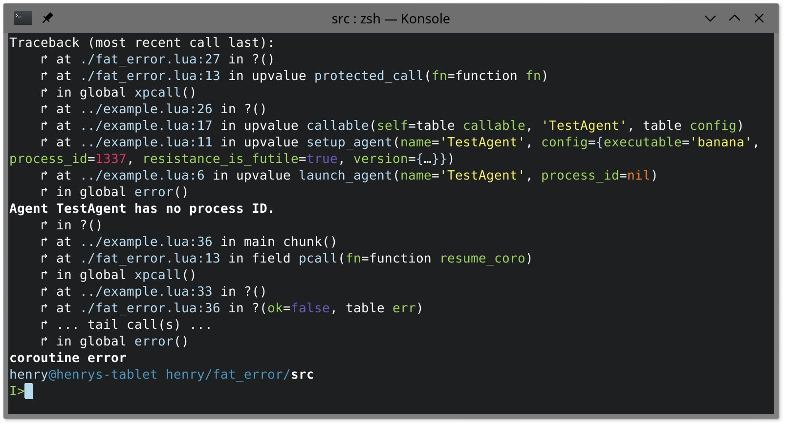

fat error
=========

Replace error messages with error objects that store metadata.

"But why?"

Well, by storing the metadata in a table instead of enriching the error message
with it allows some neat things:

Errors can be chained e.g. for propagating out of a coroutine,
so you can print the error chain in a consistent manner.
Furthermore one can print the error to multiple destinations: A colored version
for the terminal, a colorless version for the log file, or even aggregate it in
a database for later processing/analysis.




Example
-------

### Collecting and printing errors:

```lua
local fat_error   = require'fat_error'
local write_error = require'fat_error.writers.FancyWriter'{}

local ok, result_or_err = fat_error.pcall(unsafe_function)
if not ok then
    write_error(result_or_err)
end
```

Error messages, e.g. generated by `error` or `assert`, get implicitly
converted to Error objects.


### Propagating errors:

```lua
local fat_error = require'fat_error'
local Error     = require'fat_error.Error'

local coro_fn = function() ... end

local coro = coroutine.create(function()
    -- This is needed in order to collect metadata:
    local ok, result_or_err = fat_error.pcall(coro_fn)
    if not ok then
        error(result_or_err)
    end
end)

local ok, result_or_err = coroutine.resume(coro)
if not ok then
    -- Propagate error further up:
    error(Error('coroutine error', result_or_err))
end
```

Since this is quite tedious there is a simpler method:

```lua
local fat_error = require'fat_error'

local coro_fn = function() ... end

local coro = fat_error.create_coroutine_with_error_handler(coro_fn)

local result = fat_error.resume_coroutine_and_propagate_error(coro)
```


API
---

### Module `fat_error`

#### Function `.message_handler(message)`

Automatically transforms error messages to `Error` objects and gathers metadata.


#### Function `.pcall(fn, ...)`

Just a convenient wrapper to use the `fat_error.message_handler` with `xpcall`.


#### Function `.create_coroutine_with_error_handler(fn)`

Wraps `coroutine.create` to generate `Error` objects.


#### Function `.resume_coroutine_and_propagate_error(coro, ...)`

Wraps `coroutine.resume` to propagate received errors.

As errors are propagated implicitly the function only returns yielded values.


### Class `fat_error.Error`

It has these properties:

- `message`
- `parent`: `Error` object that caused this one to be raised.
- `frames`: List of `Frame` objects that describe the threads stack when the
error occured.


#### Constructor `Error(message[, parent])`

Creates a new `Error` object with the given message.

You can chain errors by using the `parent` argument.


#### Static function `.is_instance(value)`

Test if a value is an `Error` instance.


#### Method `:trace_back(level)`

Collects stack frames starting at the given level.

This is normally not needed as `Error.message_handler` calls this already.


### Class `fat_error.Frame`

Collects and stores information about a stack frame:

It has the same properties which
[`debug.getinfo()` returns](http://www.lua.org/manual/5.3/manual.html#lua_Debug).

Furthermore it collects information about local and upvalue variables.
See the methods below for ways to access these.

Variables have these properties:

- `name`: How the variable is called in the code.  Note that *variadic arguments
have no name*.
- `value`: The value it had when it was analyzed.  Note that tables are not
cloned and therefore *their contents may still change*.
- `is_upvalue`
- `parameter_index`: If the variable is a function parameter this holds its
position.  Goes from 1 to `nparams`.
- `origin`: Name of the local/upvalue/slot which probably provided the value.
This may be `nil`.


#### Constructor `Frame(thread, level)`

Creates a new `Frame` object from the function running at the given stack
level.

The thread defaults to the currently running one.


#### Static function `.trace(thread, level[, max_level])`

Collects stack frames starting at the given level.


#### Method `:get_parameters()`

Returns function parameters as a list.

Variables without names are variadic arguments.


#### Method `:get_locals()`

Returns all internal local variables by name.

This includes the parameters, except for the variadic ones.


#### Method `:get_upvalues()`

Returns all external local variables by name.


#### Method `:get_named_variables()`

Returns all visible variables by name.


#### Method `:get_all_variables()`

Returns all variables as a list.


### Factory `fat_error.writers.FancyWriter`

Writes `Error` objects.


####  Factory `FancyWriter{...}`

Creates a new error writer instance.

- `destination`: Either a file or a callback. The callback should behave like
the `write` method of file objects.  Defaults to `io.stderr`.

- `use_color`: Whether to use ANSI escape codes to colorize the output.
Defaults to `true` if terminal color support is detected.

- `head_location`: By default the deepest frame is printed first and the error
message is at the bottom.

- `show_variables`:
  - `none` or ``: No variables are shown.
  - `parameters`: Show only values of function parameters. (default)
  - `all`: Show all variable values.

- `show_origin`: Print the origin variable of values if available.  Defaults to
`true`.


License and copyright
---------------------

Copyright © Henry Kielmann

`fat_error` is licensed under the MIT license which can be found in the LICENSE file.
